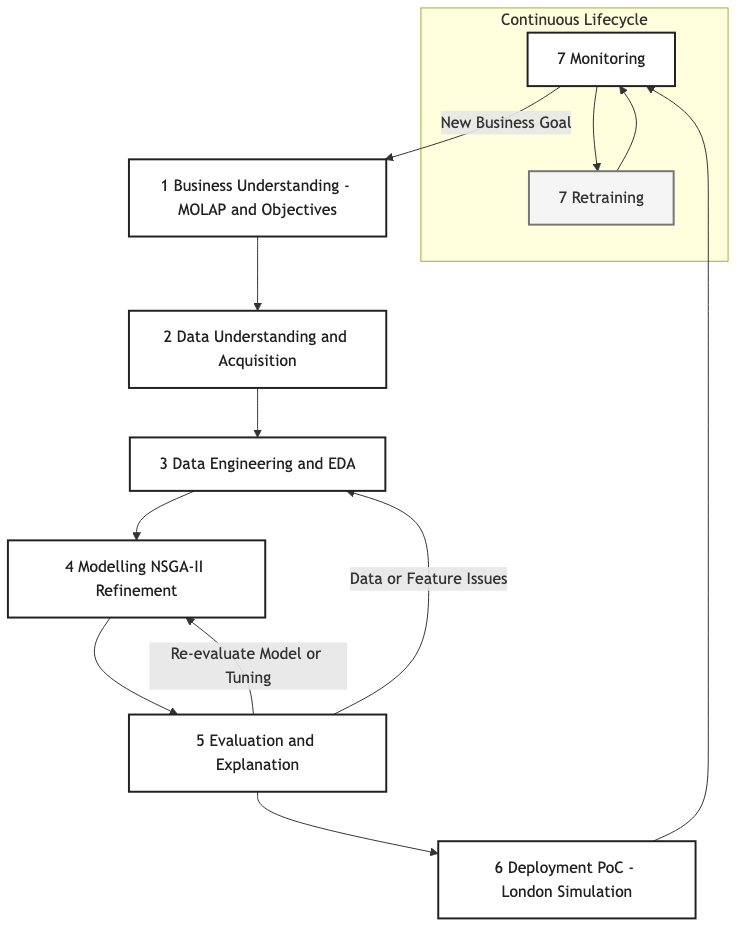
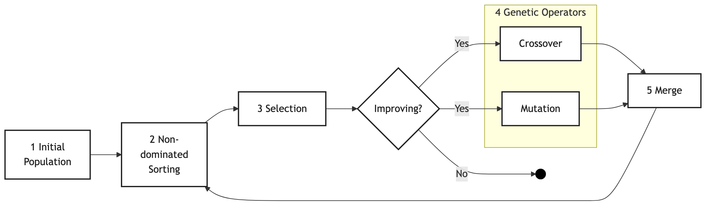

# NSGA-II Nursing Service Location Optimization in London

## Project Overview

This project demonstrates two approaches for **multi-objective optimization** using the **NSGA-II genetic algorithm** to determine optimal locations for **nursing service centers**.  
Two case studies are included:

- **London** — simulated data  
- **Shanghai** — real-world data sourced from a published dataset

The **Shanghai dataset** originates from the paper:

> *Efficient methods for a bi-objective nursing home location and allocation problem: A case study*  
> *Applied Soft Computing*, 2018  
> DOI: [10.1016/j.asoc.2018.01.014](https://doi.org/10.1016/j.asoc.2018.01.014)  
> Dataset: [http://pan.baidu.com/s/1kUFD3wV](http://pan.baidu.com/s/1kUFD3wV)

---

### Purpose

This repository is used to **support and reproduce our paper presented at a conference**.  
It does **not** aim to fully reproduce the referenced Shanghai study.  
Instead, it is *inspired by its approach* and uses the dataset for **demonstration purposes** — showing how the **NSGA-II algorithm** can be implemented and adapted to solve similar **nonlinear, constrained, multi-objective optimization problems** in domains such as healthcare service network design, especially using Python.

---

### Key Features

- Implementation of NSGA-II from scratch in MATLAB and python.
- Two regional case studies (London, Shanghai)  
- Example scripts for visualization and Pareto front plotting  
- Modular design for easy adaptation to other datasets

---

### Note

This code is intended for **research and educational use** only.  
The Shanghai dataset remains the intellectual property of the original authors and is used here solely for demonstration and non-commercial academic purposes.


## Project Structure

### 1. Streamlit Demo App

- **File:** `london-overlay-nsga-map-app.py`
- **Purpose:** Interactive, visual demonstration of NSGA-II for nursing center placement in London.
- **Features:**
  - Animated genetic algorithm evolution over generations.
  - Interactive map with candidate locations and patient heatmap.
  - Slider and step button for exploring generations.
  - Designed for teaching, demo, and intuitive understanding.

#### Demo


---

### 2. NSGA-II Reproduction & Analysis

- **File:** `nsga_reproduced.py`
- **Purpose:** Detailed, reproducible implementation of NSGA-II for scientific analysis and paper reproduction.
- **Features:**
  - Loads real candidate and demand data from Excel files in `data/`.
  - Compares NSGA-II optimization with a baseline method.
  - Plots spatial solutions and Pareto fronts.
  - Outputs results for publication and benchmarking.

---

## Requirements

### Streamlit Demo

See `requirements-streamlit.txt` for minimal dependencies.

### NSGA-II Reproduction

See `requirements-nsga.txt` for scientific dependencies.


### Merged Requirements

If you want to install everything at once, use `requirements.txt`.

---

## Notes

- The Streamlit app uses simulated data (random lat/lon within London's bounding box).
- The NSGA-II reproduction uses real candidate and demand data from Excel files in the `data/` folder.
- Both parts use the [pymoo](https://pymoo.org/) library for multi-objective optimization.
- No external APIs (e.g., Google Maps) are used, making this easy to run offline or in classroom settings.

## How to run

### Streamlit Demo
- Python 3.7+
- pip

## Installation

First, create a virtual environment (optional but recommended):

```bash
python -m venv venv
source venv/bin/activate  # On Windows: venv\Scripts\activate
```

Then install dependencies from `requirements-streamlit.txt` or `requirements.txt`.

```bash
pip install -r requirements.txt
```

## Running the App

```bash
streamlit run london-overlay-nsga-map-app.py
```

This will open a new browser window with the interactive map interface.

### NSGA-II Reproduction
1. Install dependencies from `requirements-nsga.txt` or `requirements.txt`.
2. Ensure your Excel data files are in the `data/` folder.
3. Run the script:

```bash
 python nsga_reproduced.py
```

## Project development process / Methodology





## Optional Extensions

- Include real healthcare facility locations as constraints.
- Replace the objective function with real-world service efficiency metrics.
- Extend the analysis to other cities or datasets.

## License

This software is licensed for NON-COMMERCIAL use only. For commercial use, please contact prof.dr.rer.nat.lu@gmail.com.

See [LICENSE](LICENSE) for license details.

## Project QR Code

Scan to visit the GitHub repository:

