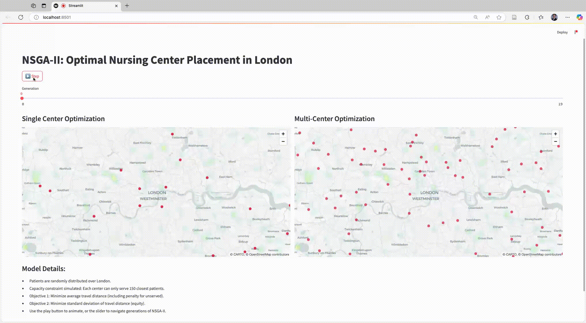

# NSGA-II Nursing Service Location Optimization in London

This project demonstrates a multi-objective optimization using the NSGA-II genetic algorithm to find optimal locations for nursing service centers in a simulated London area. The optimization evolves over multiple generations and is visualized using an interactive map in Streamlit.

## Demo



## Features

- Optimization based on proximity to the London city center and simulated service overlap.
- Interactive map displaying candidate locations for each generation.
- Slider to animate the genetic algorithm's evolution over time.

## Requirements

- Python 3.7+
- pip

## Installation

First, create a virtual environment (optional but recommended):

```bash
python -m venv venv
source venv/bin/activate  # On Windows: venv\Scripts\activate
```

Then install the required packages:

```bash
pip install streamlit pymoo numpy pandas
```

## Running the App

```bash
streamlit run london-overlay-nsga-map-app.py
```

This will open a new browser window with the interactive map interface.

## Notes

- This app uses simulated data (random lat/lon within London's bounding box).
- The optimization is done using the [pymoo](https://pymoo.org/) library.
- No external APIs (e.g., Google Maps) are used, making this easy to run offline or in classroom settings.

## Optional Extensions

- Include real healthcare facility locations as constraints.
- Replace the objective function with real-world service efficiency metrics.

## License

This software is licensed for NON-COMMERCIAL use only. For commercial use, please contact prof.dr.rer.nat.lu@gmail.com.

See [LICENSE](LICENSE) for license details.
